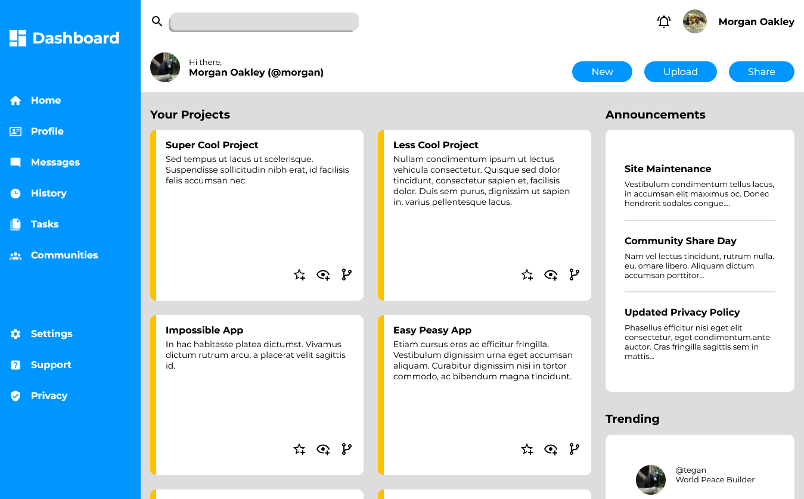

# The Odin Project - Admin Dashboard solution

This is a solution to the [Admin-Dashboard project on The Odin Project](https://www.theodinproject.com/lessons/node-path-intermediate-html-and-css-admin-dashboard). 

## Table of contents

- [Overview](#overview) 
  - [Screenshot](#screenshot)
  - [Links](#links)
- [My process](#my-process)
  - [Built with](#built-with)
  - [What I learned](#what-i-learned)  
- [Author](#author)
- [Acknowledgments](#acknowledgments)
 

## Overview

### Screenshot

 

### Links

- Solution URL: [Admin Dashboard](https://github.com/KenawMarie/odin-Admin-Dashboard)
- Live Site URL: [ live site ](https://kenawmarie.github.io/odin-Admin-Dashboard/)

## My process

### Built with

- Semantic HTML5 markup
- svg  
- positioning
- Flexbox  
- CSS Grid

 

### What I learned

i learnt how to use css grid.
 
 

## Author

- Website - [Github-Kenaw Marie](https://github.com/KenawMarie)
- The Odin Project - [@KenawMarie](https://www.theodinproject.com/dashboard) 
 

## Acknowledgments

 I wanna say thank you for The Odin project volunteers and contributors.
